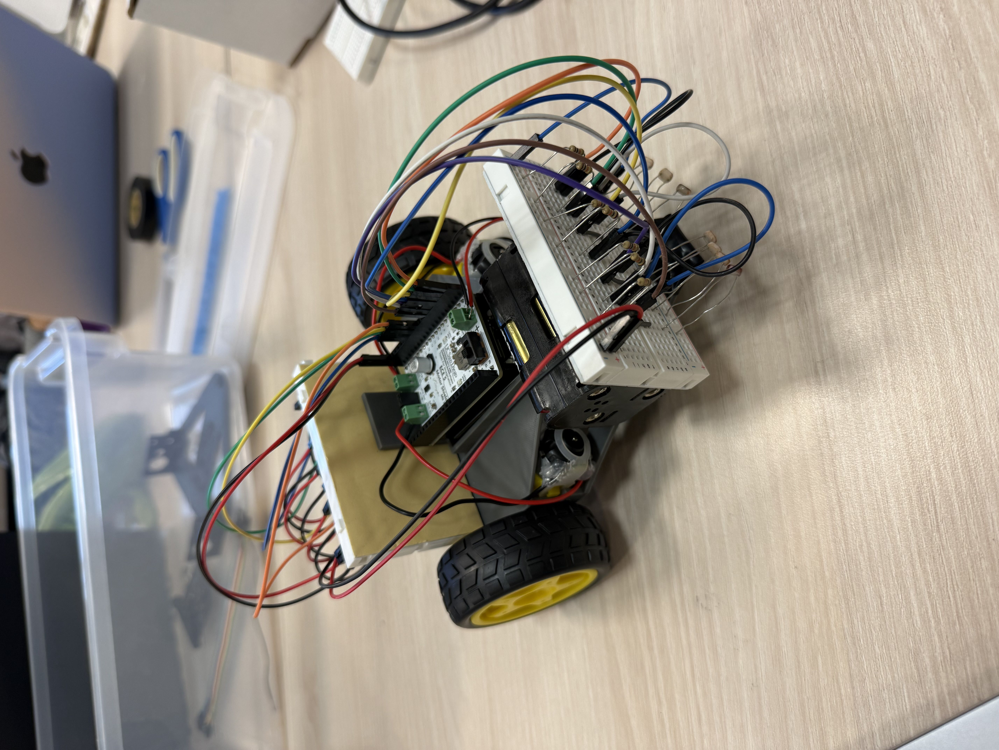
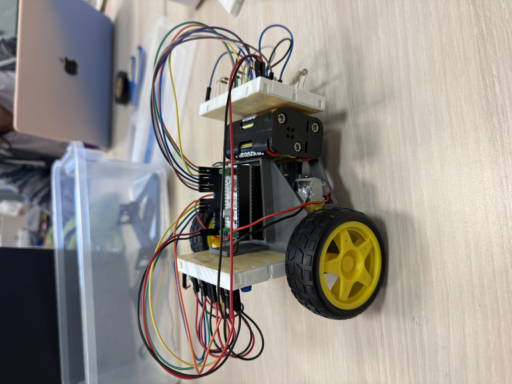
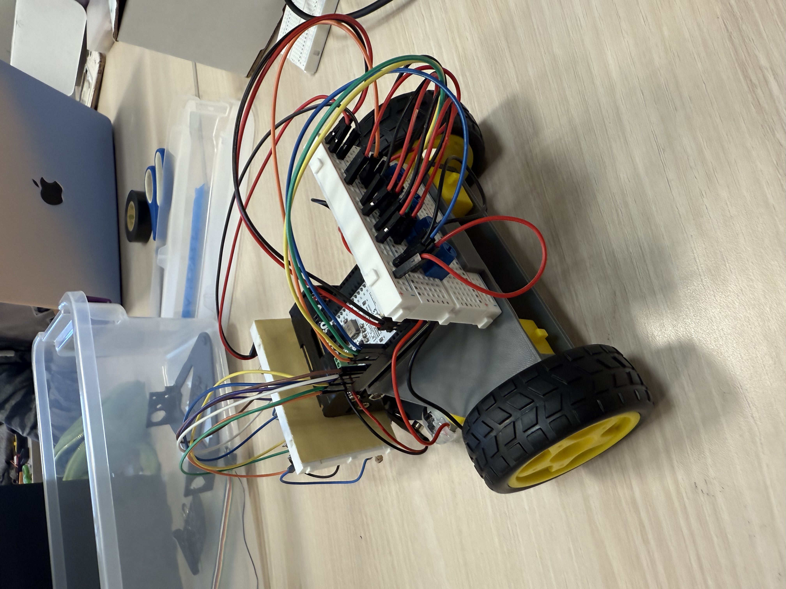

# ECE5_line_robot

<h1 align="center">Team 3 | Pizza People</h1

>

 Members: Amanda Welly | Olivia Ma | Zoe de Walque | Jiaying Xu | Casssandra Park 

<h2 align="center">Initial Robot Prototype</h2>

<h2 align="center">Prototype Following a Line</h2>

<video src="https://github.com/user-attachments/assets/4e209978-c40b-4f11-912b-1c49b6056f78" muted controls width="80%" controls></video>

<h2 align="center">Prototype Iterations</h2>

